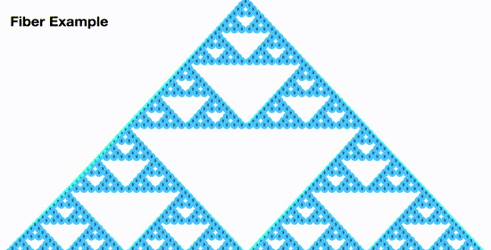

#### element diff
- insert_markup、move_existing、delete_node
##### move_existing
generateComponentChildren调用 receiveComponent, prev = next

删A加B，删B加A，删C加D，删D加C
key--diff算法中给我们的唯一标识，同层diff当中比较的时候

B不变，A往后移，D不变，C往后移
lastindex、顺序优化（当前index大于lastindex的时候说明是新增节点，不会对其他节点产生影响,小于lastindex说明是之前的,不做操作？？？）
##### homework

ABC移动到D后面
D对应的是lastindex，新的Dindex小于lastindex,所以D不变
尽量避免将最后一个节点，直接移动到所有节点之前，真正移动并不是移动的1个，而是移动的之前所有的，会影响react的性能
### 总结
- O(n^3) => O(n) (diff算法)
- 分层比较
- component diff
- key -> element diff
- 建议：开发组件，dom结构稳定，提升性能
- 建议：避免直接将行尾的元素插到最前面
- 擅用 shouldComponentUpdate() (告诉react需不需要去做diff)
### snabbdom (vue、react)--》经典、解决了上述的问题、vue2.0也引用的此库
- vnode.js Symbol保证唯一性
- 为什么text会与children共存，而不是children的一个函数？（dom对应的children、component、text）
  text节点与其他类型的节点处理起来差异太大了;text代表vnode,对应的是vtextnode；
- h.js  h函数:生成真正的vdom树
- index.js核心：createElm  patchVnode
双端比较算法

inferno.js vue3.0借鉴的此库对算法进行的优化，号称最快的diff算法
eg. react中会将abc移动到相应的位置，在inferno.js中会将d移动到abc前面
abcd
dabc

## 调度

上面的比较卡，fiber的比较流畅；
卡是因为什么？60帧-肉眼观察到的比较流畅的；每秒60帧，16ms一帧；这意味着每一帧的普通dom的改变需要在16ms之间，帧数比较低的时候就会出现卡顿，一帧需要消耗的时间更长；
整个的浏览器，js线程与渲染是互斥的，都在主线程里面互斥的；当js正在执行一个特别特别大的东西的时候（比如一个特别大的diff）,这时候又做了一些用户的交互操作，这时候用户就卡了；
fiber帮我们做了一些切片，紧接着让你在闲时去执行；
setState--React开始协调过程中，首先会将你的vdom进行遍历，然后进行diff,diff完去拿到真实的dom,紧接着再去传给render,再去渲染，这时候页面才会更新，这是一个普通的render的过程；
正常一个普通的树是没有问题的，但当vdom的树特别大，这时候协调的过程会特别的长，特别耗费时间，当是上百ms的时候，这期间主线程会被js给占用了，这时候你的布局、交互、渲染都会停止，这就造成用户的卡顿；所以rect做了一个fiber;

## fiber
- vdom层
- reconciler层（协调层）
- render层 reactDOM、RN(不同平台) ReactNative
### time slice(时间切片)
完成一部分任务，将控制权交回给浏览器，让浏览器再去渲染，等浏览器忙完了，并且有闲的时间，紧接着再去执行我们的任务；
旧版本的时候是通过递归，一个大的调用栈stack,直到栈递归完空了为止；
fiber整个是一个链表的形式，最终以链表的形式去遍历整个树；
为什么以链表的形式去实现呢？（数据结构）更灵活、暂停、继续、增加、丢弃等任务；
### requestIdleCallback(在浏览器空闲的时候去调用函数) && requestAnimationFrame
打日志这种可以放到requestIdleCallback中，低优先级的任务，回调不一定执行；
requestAnimationFrame:回调每一帧都确定执行，高优先级的任务；
网页上所有的东西都是它通过帧去绘制出来的；

浏览器中一帧的常见操作？

如果一帧中的操作比较少，用不了16ms,那空闲时间就可以执行idleCallback,如果因为timeout而执行，说明这时候已经出现卡顿了;
不能在requestIdleCallback中千万不要进行dom的操作；因为1.是闲时进行，当前帧都已经进行完成，再进行dom操作，dom又要变化，又要重新绘制一遍；2.dom操作是异步的，并且不可控（包括promise也不建议执行）；利用闲时意味着所有操作都应该是可控的；

### react fiber reconciler(调度),主要做了以下两件事
- 计算任务的time(expriationTime)
- requestIdleCallback polyfill版本 (homework);
  三个关键点多次（用定时器setTimeout?requestAnimationFrame?）、空闲、渲染过后;
  requestAnimationFrame问题；重绘之前、后台的时候回调函数不执行；不执行的时候用setTimeout去补救；
  MessageChannel?宏任务？微任务？渲染完成后执行的是宏任务；不知道什么时候渲染完，那就借助于宏任务；为了最快的执行，选择优先级最高的MessageChannel;
  requestAnimationFrame + 计算frame时间和下一帧的时间 + messageChannel

#### expriationTime
当前时间 + 常量（优先级）获得当前谁的优先级高，再减去当前时间，就能获取当前任务的timeout;
用performance.now获取当前时间，不用Date.now,精度不高问题；