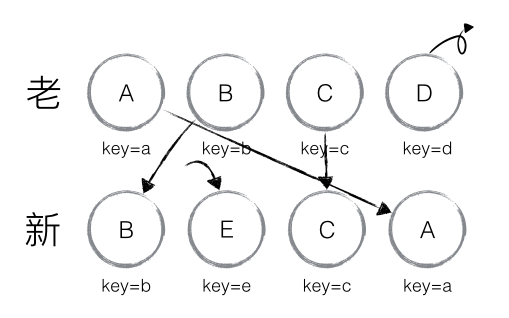
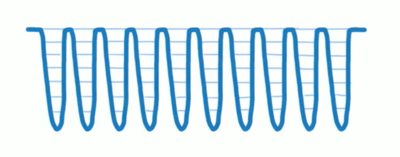

# react 源码 - lesson

## mixin、hoc、hook

## 渲染过程
- react.createElement
- reactElement对象（vdom）
- reactDOM.render ==> 真实dom

### vdom的组成
- type
- key
- ref
- props
- owner
- self
- _source

## vdom

解决重要的三个问题：

- 高效的diff算法
- 只更新需要更新的dom节点；
- 数据变化监测，batch dom读写操作；

### diff算法
- 递归： O(n^3)
- react vdom diff O(n)

#### diff 策略
- 很少跨层，所以我们就同层比较，不跨层比较；
- 相同component有相同的tree结构，不同的……；
- 同一层级的子节点，key；

tree diff、component diff、element diff；

#### tree diff

updateDepth

#### Q: 如果有跨层级的移动，应该如何处理？

createA -> createB -> createC -> delete A

#### component diff

- same component 
- different component, dirty component，替换所有的子节点
- shouldComponentUpdate()

#### element diff

- insert_markup、move_existing、delete_node

##### move_existing
generateComponentChildren调用 receiveComponent，prev = next

key

lastindex、顺序优化

##### 作业

### 总结
- O(n^3) => O(n)
- 分层比较
- component diff
- key -》 element diff
- 建议： 开发组件，dom结构稳定，提升性能
- 建议：避免直接将航尾的元素差到最前面；
- shouldComponentUpdate（）

### snabbdom
双端比较算法

inferno.js号称最快的diff算法

abcd
dabc

## 调度

## fiber

- vdom层
- reconciler层
- render层：reactDOM、RN

### time slice

### requestIdleCallback && requestAnimationFrame

### react fiber reconciler （调度）
- 计算任务的time（expriationTime）
- requestIdleCallback polyfill版本（作业）\ MessageChannel

requestAnimationFrame + 计算frame时间和下一frame的时间 + mesaageChannel

#### expriationTime
当前时间 + 常量（优先级）

#### 总结
- 首先每个任务都会有各自的优先级，通过当前时间加上优先级所对应的常量我们可以计算出 expriationTime，高优先级的任务会打断低优先级任务
- 在调度之前，判断当前任务是否过期，过期的话无须调度，直接调用 port.postMessage(undefined)，这样就能在渲染后马上执行过期任务了
- 如果任务没有过期，就通过 requestAnimationFrame 启动定时器，在重绘前调用回调方法
- 在回调方法中我们首先需要计算每一帧的时间以及下一帧的时间，然后执行 port.postMessage(undefined)
- channel.port1.onmessage 会在渲染后被调用，在这个过程中我们首先需要去判断当前时间是否小于下一帧时间。如果小于的话就代表我们尚有空余时间去执行任务；如果大于的话就代表当前帧已经没有空闲时间了，这时候我们需要去判断是否有任务过期，过期的话不管三七二十一还是得去执行这个任务。如果没有过期的话，那就只能把这个任务丢到下一帧看能不能执行了

## eventemitter.js(待定)